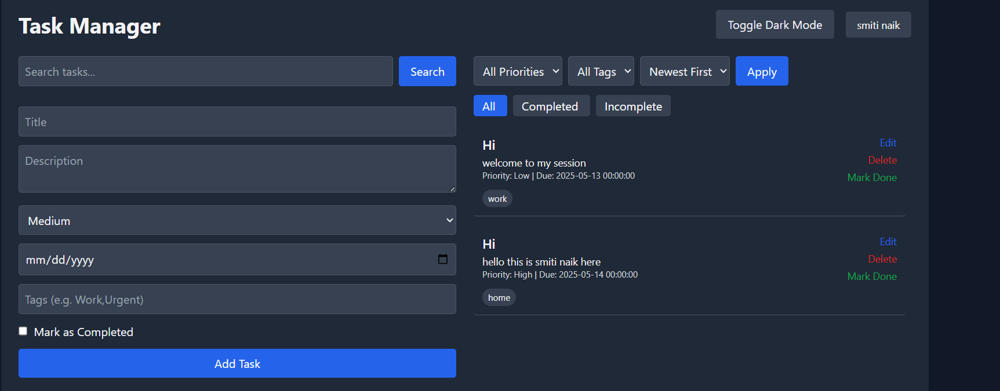
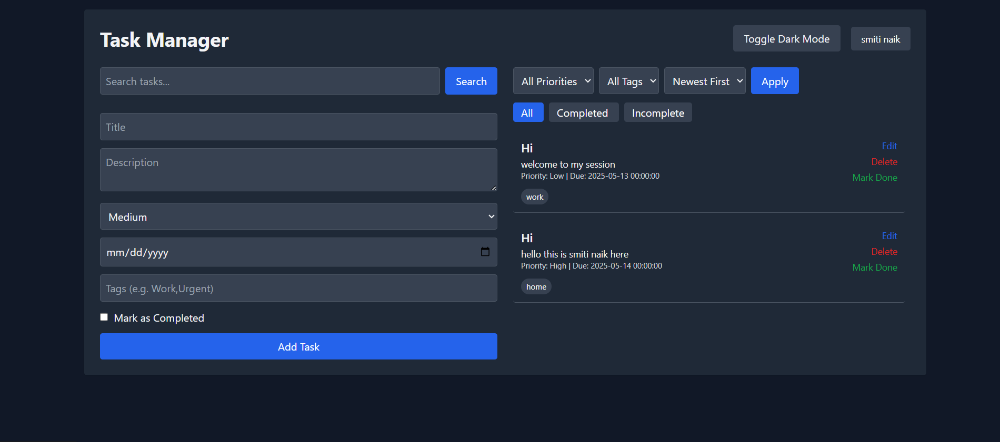
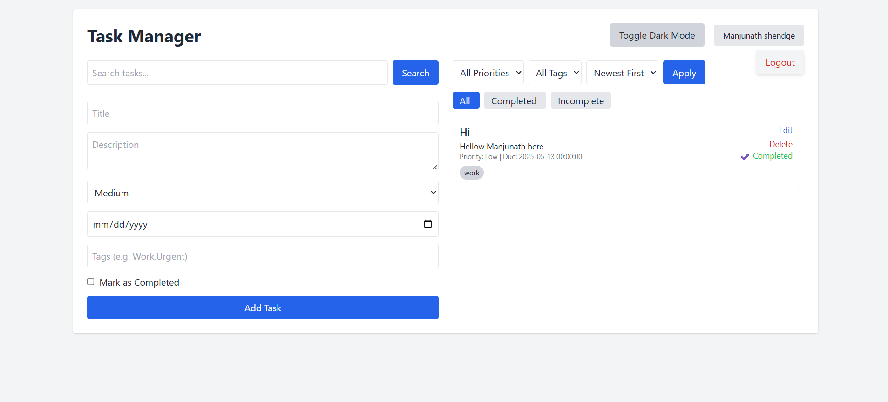
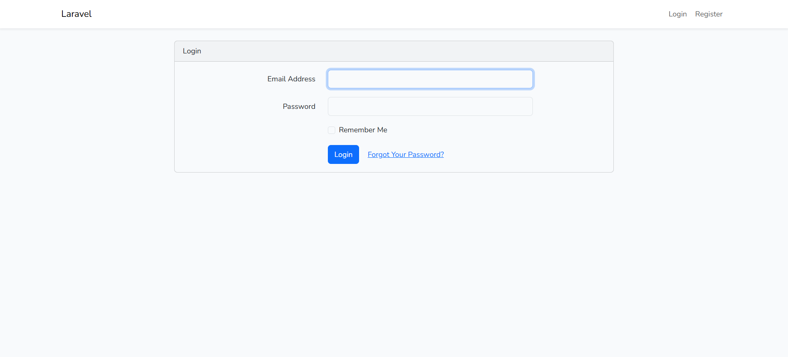
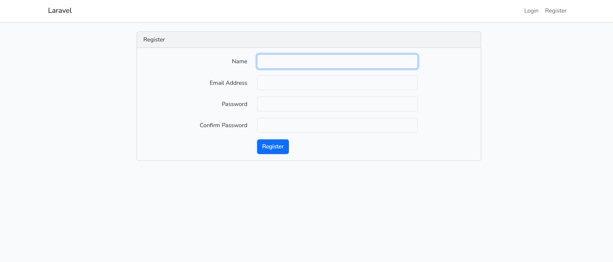
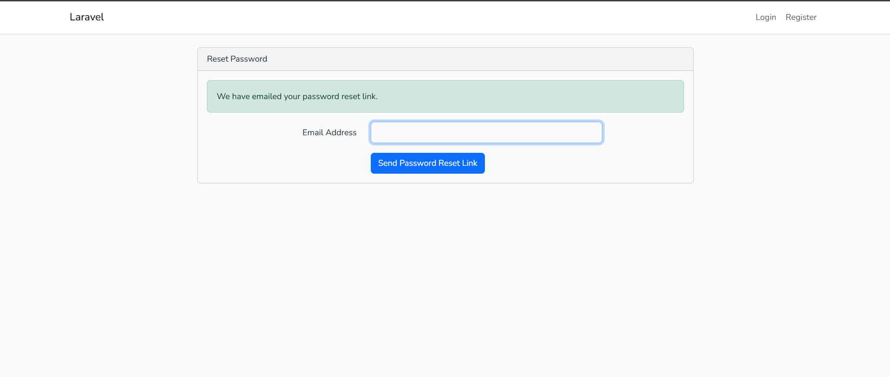
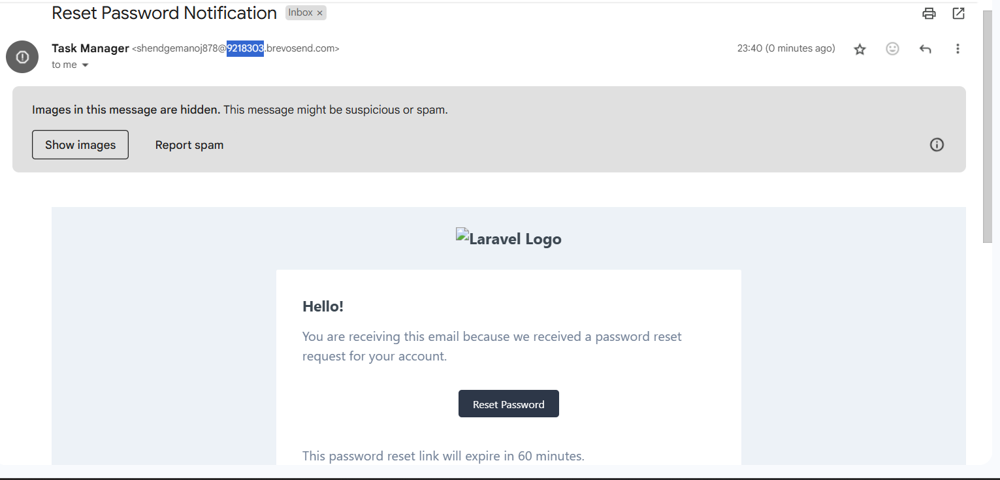
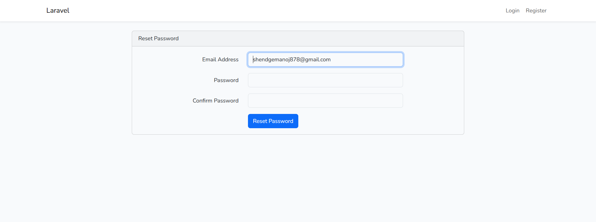

# ✅ Task Manager App

A simple and efficient task management application built with **Laravel + Vite**. It allows users to create, update, delete tasks and receive **email reminders 3 days before due dates**.

---

## 📸 Screenshots

### 🏠 Landing Page





### 🔐 Login Page


### 🔐 Register Page


### Register Page





---

## 🚀 Features

- User Authentication (Login/Register)
- Create, View, Edit, Delete Tasks
- Email reminders 3 days before task deadlines
- Task status: Pending / Completed
- Responsive design with TailwindCSS
- RESTful API structure
- Vite for frontend asset bundling

---

## 🛠️ Tech Stack

- Laravel 10+
- PHP 8+
- MySQL / SQLite
- Tailwind CSS
- Vite
- Blade / Vue (optional)
- Laravel Breeze / Jetstream (optional for auth)

---

## 📦 Installation

```bash
git clone https://github.com/your-username/task-manager.git
cd task-manager

composer install
npm install
cp .env.example .env

php artisan key:generate
php artisan migrate
npm run dev
php artisan serve
